# VRDance (Let's TAICHI)

The intent was to develop a motion tracking hardware device, and train a LSTM model for mapping the physical movement into VR Avatar Movement. (But because of delay, we scoped down from Dance to TAICHI, lol).

The Technology is developed using MPU9250 for motion detection and ESP32 for data transmission. The data is collected live on MPU9250 after calibration, then the data is sent to Firebase cloud very 100ms.

I have trained a simple LSTM AI model using hardware movement data as input and using web camera to Avatar movement in Unity detection AI model(ThreeDPoseUnityBarracuda) as target outputs.

And I was able to achieve a simple rusty AI model that can translate users physical movement with hardware devices on their body into VR avatar movements.

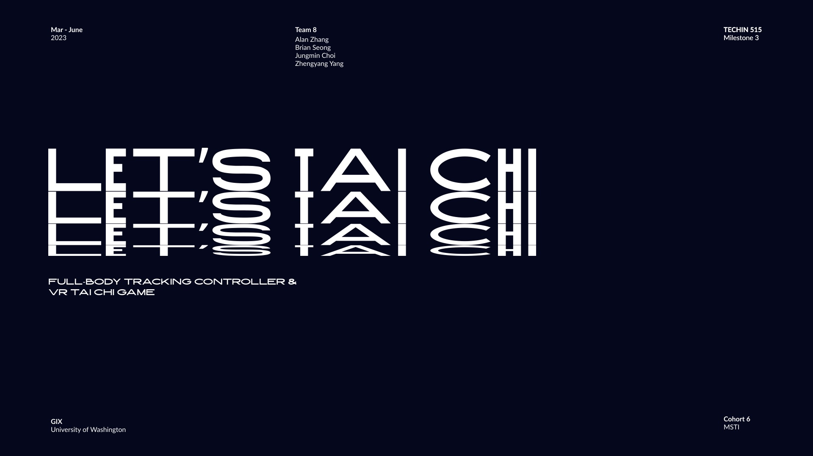
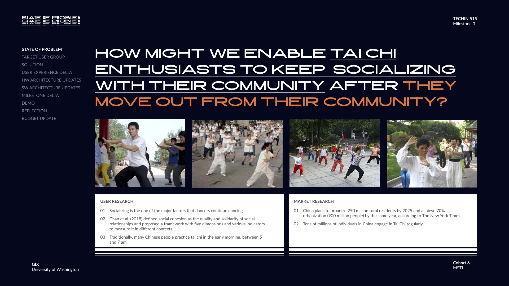
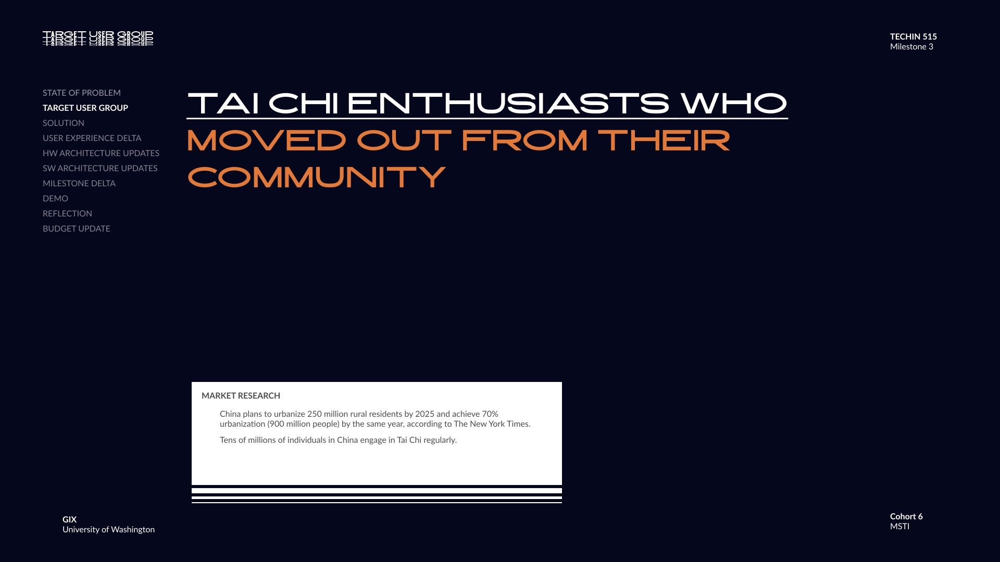
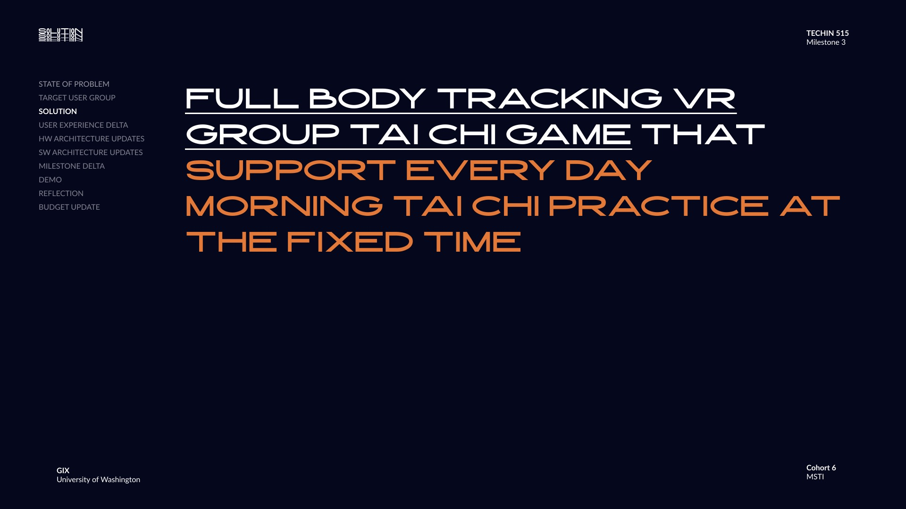
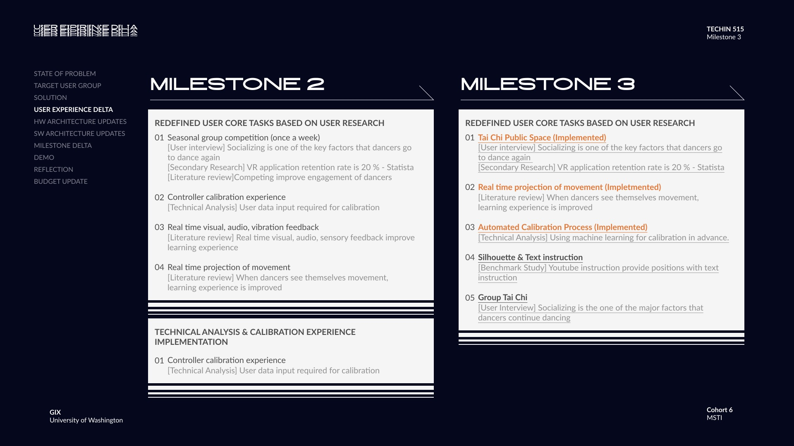
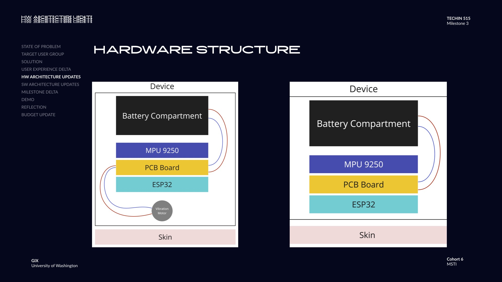
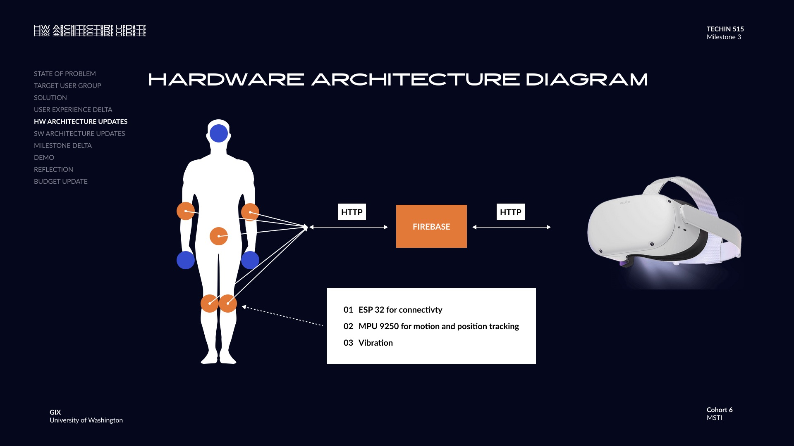
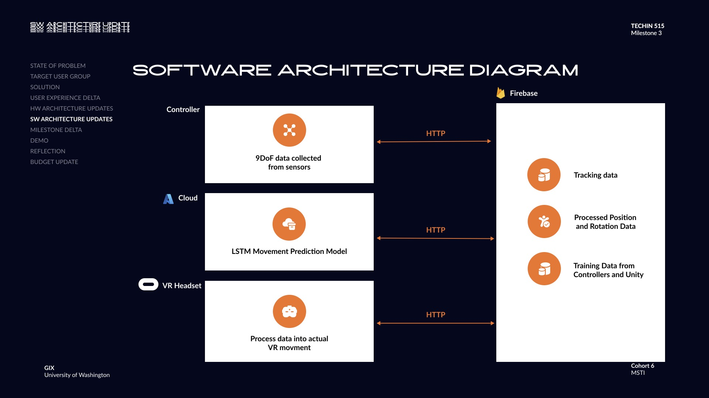
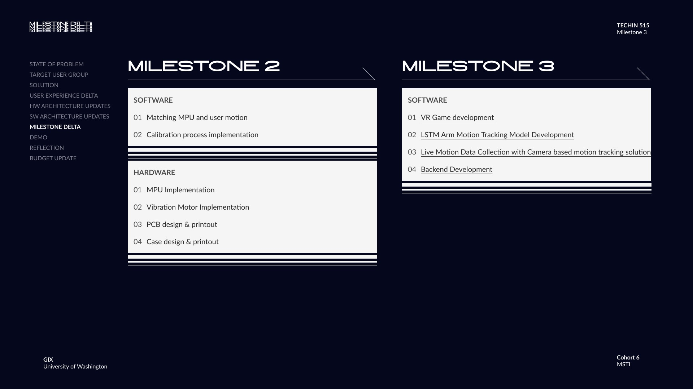
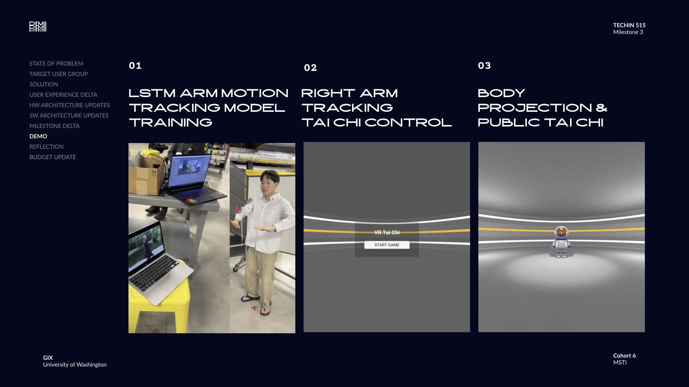
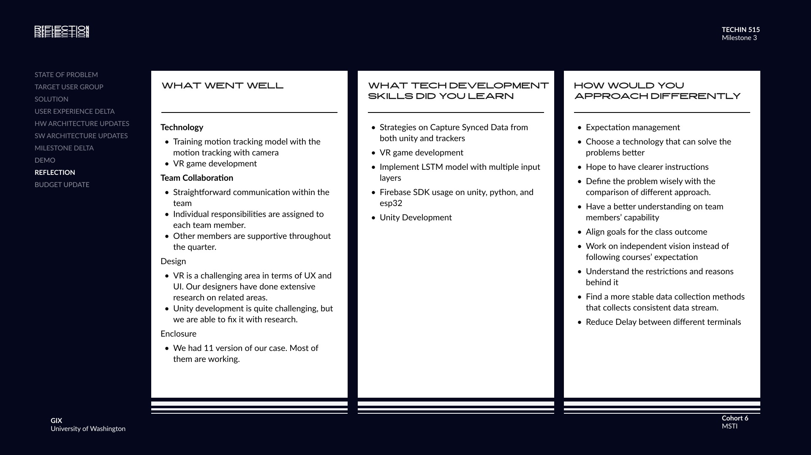